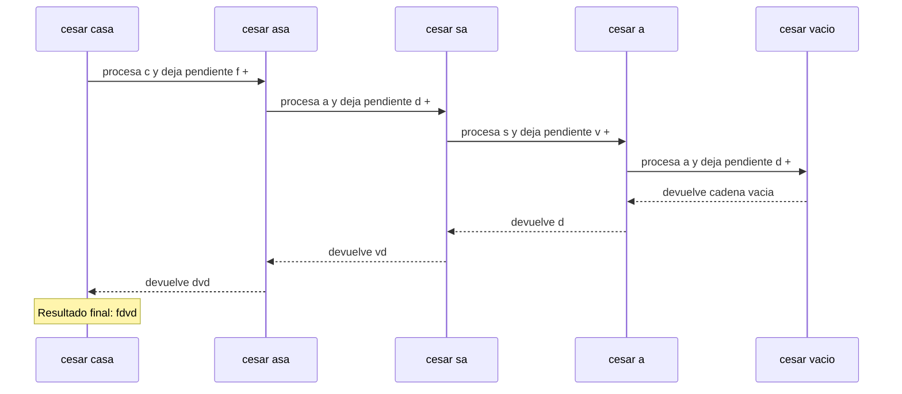
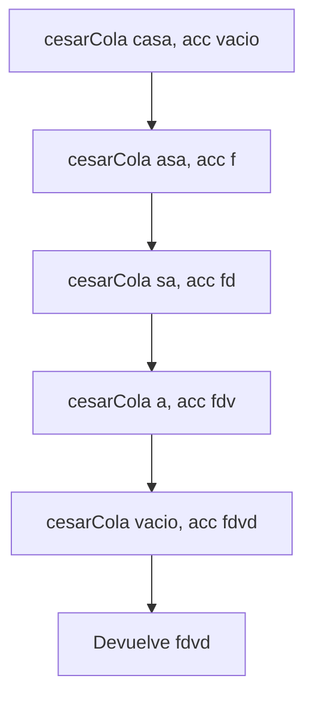

# Proceso de los cifrados clasicos

Asignatura: Fundamentos de Programacion Funcional y Concurrente.

## 1. Funcion cesar

### Definicion del algoritmo

La funcion `cesar(m, k)` cifra un mensaje cambiando cada letra minuscula segun el desplazamiento indicado. Los espacios, numeros y otros caracteres quedan iguales.

### Caso base

```scala
if (m.isEmpty) ""
```

Cuando el mensaje esta vacio, devuelve una cadena vacia porque no quedan caracteres por procesar.

### Caso recursivo

La funcion toma el primer caracter y el resto del mensaje. Si el caracter es minuscula, calcula su nueva posicion usando el desplazamiento y el modulo 26. Despues junta la letra cifrada con el resultado de llamar a `cesar` con el resto del mensaje.

### Llamados de pila

Ejemplo: `cesar("casa", 3)`

```text
cesar("casa", 3)
= "f" + cesar("asa", 3)
= "f" + "d" + cesar("sa", 3)
= "f" + "d" + "v" + cesar("a", 3)
= "f" + "d" + "v" + "d" + cesar("", 3)
= "f" + "d" + "v" + "d" + ""
= "fdvd"
```

Primero se hacen los llamados hasta llegar al mensaje vacio. Despues se juntan las letras cuando cada llamado recibe el resultado del siguiente.



En esta funcion los llamados anteriores deben esperar a que termine el siguiente para poder juntar las letras. Por eso quedan operaciones pendientes mientras se procesa el mensaje.

## 2. Funcion cesarCola

### Definicion del algoritmo

La funcion `cesarCola(m, k, acc)` cifra el mensaje igual que `cesar`, pero guarda las letras procesadas en el acumulador `acc`. Utiliza `@tailrec` para comprobar que el llamado recursivo este al final de la funcion.

### Caso base

```scala
if (m.isEmpty) acc
```

Cuando el mensaje queda vacio, devuelve el acumulador con el resultado completo.

### Caso recursivo

La funcion toma el primer caracter, lo cifra si es minuscula y lo agrega al acumulador. Luego continua con el resto del mensaje y pasa el acumulador actualizado al siguiente llamado.

### Llamados de pila

Ejemplo: `cesarCola("casa", 3, "")`

```text
cesarCola("casa", 3, "")
cesarCola("asa", 3, "f")
cesarCola("sa", 3, "fd")
cesarCola("a", 3, "fdv")
cesarCola("", 3, "fdvd")
= "fdvd"
```

En cada llamado, el acumulador guarda las letras que ya se procesaron. No es necesario esperar a que termine el siguiente llamado para juntar las letras, porque el resultado parcial ya esta guardado.



Como el llamado recursivo es la ultima operacion, Scala puede optimizar esta recursion de cola. Esto evita mantener una pila creciente de llamados como ocurre en la recursion normal.

## 3. Diferencia entre las dos funciones

Las dos funciones producen el mismo resultado para el mismo mensaje y desplazamiento.

En `cesar`, cada llamado deja pendiente la operacion de juntar la letra con el resultado siguiente. En `cesarCola`, el acumulador guarda el resultado parcial desde cada paso.

Por eso, `cesar` utiliza recursion normal y `cesarCola` utiliza recursion de cola. La anotacion `@tailrec` permite comprobar que la funcion esta escrita de forma que cumple esa condicion.

## 4. Funcion frecuencias

La funcion `frecuencias(m)` cuenta cuantas veces aparece cada letra minuscula del mensaje. Si una letra ya esta en la lista, aumenta su cantidad; si no, la agrega con una frecuencia de uno. Al final ordena las letras por cantidad y despues alfabeticamente.

### Caso base

```scala
if (mensaje.isEmpty) lista
```

Cuando no quedan caracteres, devuelve la lista con las frecuencias que se han contado.

### Caso recursivo

La funcion revisa el primer caracter. Si es minuscula, actualiza la lista de frecuencias. Si no lo es, lo ignora. Despues llama a `contar` con el resto del mensaje y la lista actualizada.

Ejemplo:

```text
frecuencias("abaca")
= List(('a', 3), ('b', 1), ('c', 1))
```

La funcion interna `contar` utiliza `@tailrec` porque el llamado recursivo es la ultima operacion de cada caso.

## 5. Funcion desplazamientoProbable

Esta funcion toma la letra que aparece mas veces en el mensaje y calcula la distancia entre esa letra y la `e`.

### Caso base

Si no hay letras minusculas, devuelve `0`.

### Caso general

Si hay letras, toma la primera de la lista de frecuencias y calcula el desplazamiento con la formula:

```text
(letraMasFrecuente - 'e' + 26) % 26
```

Por ejemplo, si la letra mas frecuente es `h`, el desplazamiento calculado es `3`.

Esta funcion solo calcula un desplazamiento probable, porque la letra que mas aparece no siempre corresponde a la `e` del mensaje original.

## 6. Funcion romperCesar

Esta funcion llama a `desplazamientoProbable` y utiliza el resultado en negativo para llamar a `cesar`.

```scala
val k = desplazamientoProbable(m)
cesar(m, -k)
```

Si el desplazamiento calculado es correcto, se pueden recuperar las letras originales. Si la estimacion falla, el mensaje obtenido tambien puede ser incorrecto.

Por ejemplo, si el mensaje original es `aaaa` y se cifra con desplazamiento `3`, se obtiene `dddd`. El metodo puede suponer que la `d` corresponde a la `e` original y no recuperar el mensaje esperado. Esto muestra la limitacion de utilizar solamente la letra mas frecuente.

## 7. Funcion combinaciones

La funcion `combinaciones(n, a)` calcula la cantidad de cadenas de longitud `n` que se pueden formar con `a` letras sin repetir la misma letra dos veces seguidas.

### Casos base

```scala
if (n == 0) BigInt(1)
else if (n == 1) BigInt(a)
```

Si la longitud es cero, hay una posibilidad: la cadena vacia. Si la longitud es uno, hay `a` opciones.

### Caso recursivo

```scala
BigInt(a - 1) * combinaciones(n - 1, a)
```

La funcion multiplica por `a - 1` y vuelve a calcular el resultado con una longitud menor.

Ejemplo:

```text
combinaciones(3, 4)
= 3 * combinaciones(2, 4)
= 3 * 3 * combinaciones(1, 4)
= 3 * 3 * 4
= 36
```

En cada llamado el valor de `n` disminuye hasta llegar a un caso base. Luego se realizan las multiplicaciones pendientes. La funcion utiliza `BigInt` para trabajar con resultados grandes.

## 8. Funcion vigenere

La funcion `vigenere(m, clave)` cifra cada letra minuscula usando la letra correspondiente de la clave. El acumulador guarda el resultado y `i` indica la posicion de la clave que se debe usar.

### Caso especial

Si la clave esta vacia, devuelve el mensaje original.

### Caso base

```scala
if (resto.isEmpty) acc
```

Cuando ya no queda mensaje, devuelve el acumulador.

### Caso recursivo

Si el caracter es minuscula, lo cifra usando la letra correspondiente de la clave, lo agrega al acumulador y aumenta `i`. Si no es minuscula, lo copia sin cambios y mantiene el mismo indice de la clave.

Cuando llega al final de la clave, vuelve a comenzar desde la primera letra.

Ejemplo con el mensaje `hola` y la clave `abc`:

```text
recorrer("hola", 0, "")
recorrer("ola", 1, "h")
recorrer("la", 2, "hp")
recorrer("a", 3, "hpn")
recorrer("", 4, "hpna")
= "hpna"
```

La funcion interna `recorrer` utiliza `@tailrec` porque el llamado recursivo es la ultima operacion. El resultado se guarda en el acumulador hasta terminar el mensaje.

## 9. Conclusion

En este taller se utilizaron llamados recursivos para cifrar mensajes, contar letras y calcular cantidades.

En `cesar`, las letras se juntan cuando terminan los llamados. En `cesarCola`, `frecuencias` y `vigenere`, el resultado parcial se pasa al siguiente llamado mediante un acumulador o una lista actualizada.

En `combinaciones`, el valor de `n` disminuye hasta llegar a un caso base. Por su parte, `desplazamientoProbable` y `romperCesar` dependen de una estimacion, por lo que no siempre recuperan el mensaje original.